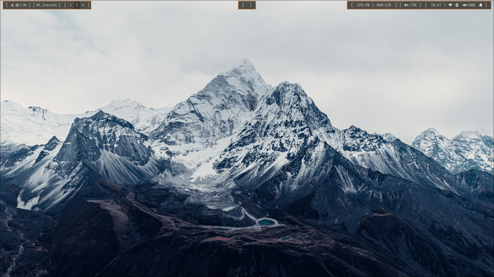
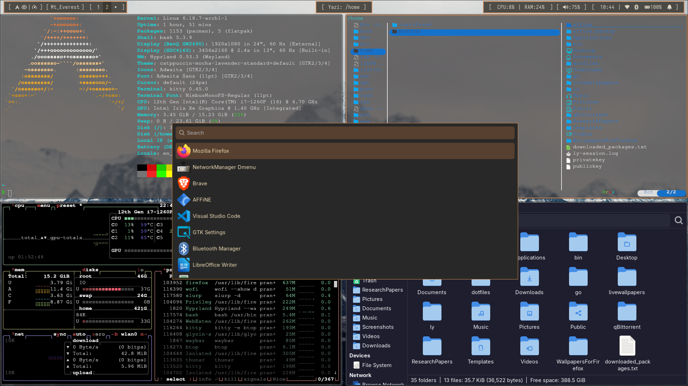
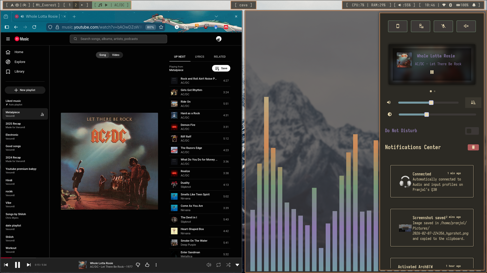

## Hyprland UI Preview

<table>
  <tr>
    <td align="center">
       
      Workspace View
    </td>
    <td align="center">
       
      Terminal Setup
    </td>
    <td align="center">
       
      Floating Windows
    </td>
  </tr>
</table>
